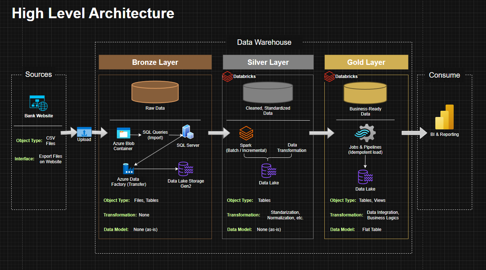
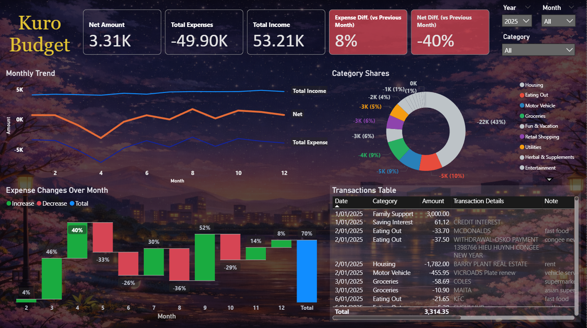
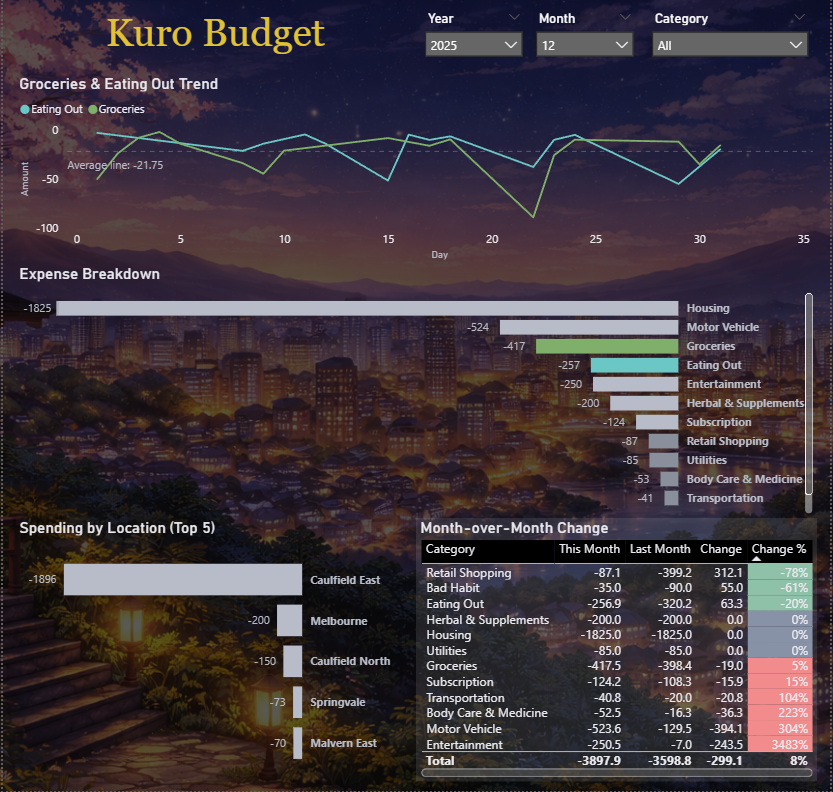

# Personal Transaction Data Warehouse 

A personal data warehouse built to ingest, clean, standardize, and analyze multi-bank transaction data using a ***Bronze → Silver → Gold*** architecture.
The project focuses on traceability, repeatability, and analytical readiness, rather than real-time processing.

---
## 🏗️ Data Architecture

The data architecture for this project follows Medallion Architecture **Bronze**, **Silver**, and **Gold** layers:


1. **Bronze Layer**
- Stores raw CSV data exactly as received from bank exports.
- Data is ingested from **Azure Blob Storage** into **Azure SQL Database**, then transferred to **Azure Data Lake** via **Azure Data Factory (ADF)** with minimal transformation.
2. **Silver Layer**
- Performs data cleansing, standardization, and normalization using **Databricks (PySpark)**.
- This layer applies business rules, categorization logic, location inference, and description normalization to produce analysis-ready transactional data.
3. **Gold Layer**
- Consolidates transactions across all banks into a single master table.
- Applies final business rules, overrides, and manual adjustments to become the **single source of truth** for dashboards, reporting, and downstream analytics.,

---
## 📖 Project Overview
This project simulates a production-style data warehouse using personal financial data.
It emphasizes:
- Clear data lineage from source files to analytics outputs
- Controlled refresh behavior (batch-oriented, non-incremental)
- Separation of raw data, business logic, and analytics layers

The warehouse is designed for monthly monitoring, acknowledging that bank exports are not real-time and may be subject to short delays.

---
## 🚀 Project Requirements

### Building the Data Warehouse (Data Engineering)
**Objective:**
Design and implement a scalable, maintainable data warehouse on Azure that ingests multi-bank transaction data, enforces clear data layering (Bronze/Silver/Gold), and supports reliable analytics and reporting.

**Specifications:**
- Azure Blob Storage for raw CSV ingestion
- Azure SQL Database for Bronze schema management and control logic
- Azure Data Factory for orchestration and data movement
- Azure Data Lake Storage Gen2 as the analytical storage layer
- Databricks (PySpark) for Silver and Gold transformations
- Batch-based refresh strategy (TRUNCATE + INSERT / full reloads)
- Explicit execution order with no hidden dependencies

---
## 📂 Repository Structure
```
Personal-Transactions-DWH-Azure/
│
├─ databricks/
│  ├─ notebooks/                 # Silver transformation notebooks
│  ├─ jobs_pipelines/            # Databricks Jobs & Pipelines 
│  ├─ utils/                     # Shared PySpark utilities and helper logic
│  └─ README.md                  # Databricks layer documentation
│
├─ datafactory/
│  ├─ dataset/                   # ADF dataset definitions (Blob, SQL, ADLS)
│  ├─ factory/                   # Azure Data Factory definition
│  ├─ LinkedService/             # Linked services (Storage, SQL DB, ADLS2)
│  ├─ pipeline/                  # Copy & orchestration pipelines
│  ├─ cdc.json                   # CDC configuration (if applicable)
│  ├─ empty.json                 # Template/placeholder config
│  └─ loop_input.txt             # Loop input for parameterised pipelines
│
├─ docs/
│  ├─ data_architecture.drawio   # Draw.io file shows the project's architecture
│  ├─ data_flow.drawio           # Draw.io file for the data flow diagram
│  └─ data_catalog.md            # Gold layer data catalog, including field descriptions and metadata
│
├─ source/
│  ├─ bank_anz/                  # Reference structure / sanitised sample files
│  ├─ bank_commbank/             # Reference structure / sanitised sample files
│  ├─ bank_westpac/              # Reference structure / sanitised sample files
│
├─ sql/
│  ├─ bronze/                    # Bronze layer DDL & stored procedures
│  └─ README.md                  # SQL execution order & design notes
│
└─ README.md                     # Project overview & usage guide
```
---
## 🗝️ Key Outputs
- Unified transaction master table across multiple banks
- Categorised income and expense records
- Monthly and historical spending trends
- Clean inputs for dashboards and forecasting models
- A reusable personal analytics framework that scales over time

---
## 📊 Dashboard Preview (Power BI)

> Dashboards are refreshed monthly to align with batch-based data ingestion and the availability of non-real-time bank exports.

The following Power BI dashboards are built on top of the **Gold layer**
and demonstrate how curated transaction data is used for monthly financial monitoring.

### Monthly Review


> High-level overview of income, expenses, and category distribution.
> Designed for quick monthly check-ins and trend awareness.

### Monthly Detail


> Transaction-level breakdown with category and time-based analysis,
> supporting deeper inspection and month-over-month comparison.

---
## 🛡️ License

This project is licensed under the [MIT License](LICENSE). You are free to use, modify, and share this project with proper attribution.
